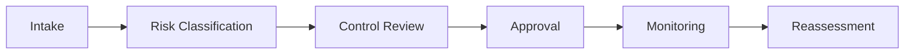

# AI Governance Operating Model

## Purpose

The operating model defines how AI use cases are proposed, reviewed, approved, monitored, and retired.
It gives the organization one predictable path for routing AI decisions and keeping evidence attached to the outcome.

## Operating Areas

- use case intake
- risk classification
- control review
- board approval
- monitoring and revalidation
- exception management
- evidence retention

## Operating Flow

## Use

Use this page to decide who owns the review, which teams must sign off, and what can move forward under exception.

## Outcome

The operating model keeps AI governance repeatable, reviewable, and easy to explain to business leaders.

## Operating Questions

- who owns the AI use case?
- what data is being used?
- what control review is required?
- what is the approval path?
- what evidence proves the control is active?

## Evidence To Collect

- intake form
- risk assessment
- approval record
- monitoring notes
- review outcome

## Outcome

The operating model keeps AI governance repeatable, reviewable, and easy to explain to business leaders.
