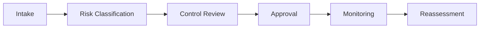

# Framework Overview

## What This Repository Does

This repository provides a governance framework for enterprise AI use cases, covering responsible AI controls, model risk, data risk, compliance, and review workflows.
It gives the organization a repeatable way to decide whether an AI use case is ready to proceed and what evidence must exist before it does.
The framework is designed to make review faster, clearer, and easier to audit.

## Governance Flow

## What It Covers

- AI governance operating model
- board review and approval
- responsible AI controls
- model risk management
- data security and privacy
- compliance alignment
- AI use case review

## How To Read It

Start with the framework overview, then move into the operating model and control matrix.
That sequence keeps the governance discussion focused on decision rights first and artifacts second.

## Result

The framework reduces review friction by making the approval path predictable for product teams, risk teams, and executives.

## Who Uses It

- AI governance leads
- risk teams
- security and privacy teams
- legal and compliance teams
- architecture review boards
- executive sponsors

## What Good Looks Like

- AI use cases are reviewed before release
- control expectations are explicit
- model and data risks are documented
- approvals are traceable
- governance is repeatable across use cases
- exceptions have an owner and an expiry date

## Practical Outcome

When the framework is used consistently, teams can review AI use cases faster and with more confidence because the decision path is already defined.

## Outputs

- governance operating model
- control matrix
- use case review map
- risk register
- maturity model

## Governance Layers

| Layer | Question | Artifact |
| --- | --- | --- |
| Intake | What is being proposed? | Review intake form |
| Risk | What could go wrong? | Risk assessment |
| Control | What must be in place? | Control matrix |
| Decision | Who approves it? | Approval record |
| Monitoring | How do we know it stayed safe? | Monitoring notes |

## Decision Rule

If the use case cannot be explained in terms of risk, control, and ownership, it is not ready for approval.
