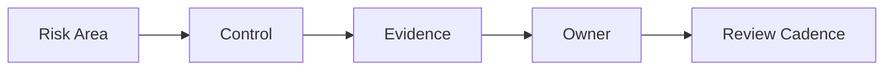

# AI Control Matrix

## Purpose

The control matrix maps AI risk areas to the controls, evidence, and owners needed to govern them.
It is the working table that shows who owns each control and what proves it is active.

## Control Areas

- use case approval
- data review
- model validation
- output review
- monitoring and retraining
- exception handling
- manual override

## Example Matrix

| Risk Area | Control | Evidence | Owner |
| --- | --- | --- | --- |
| Use case approval | Board approval | Decision log | Governance lead |
| Data privacy | Privacy review | Review note | Privacy team |
| Model behavior | Validation testing | Test results | Model owner |
| Output oversight | Human review | Review record | Business owner |
| Monitoring | Drift review | Monitoring report | Operations |
| Exception handling | Time-bound exception log | Exception record | Risk owner |

## Figure

## Matrix Guidance

Keep the matrix tied to actual evidence, not just policy language, so reviewers can see what proves the control is working.

## Use

Use this page as the primary cross-reference between AI risk areas and the evidence that supports approval.

## Outcome

A strong matrix helps reviewers compare use cases quickly and decide what needs deeper review.
